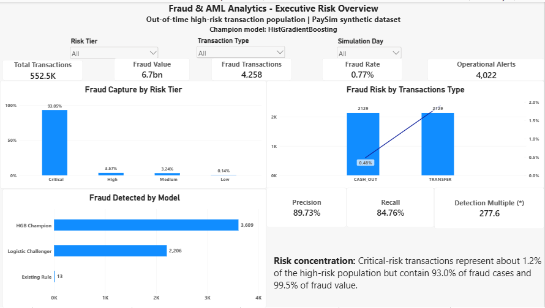
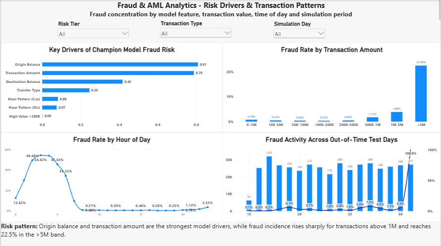
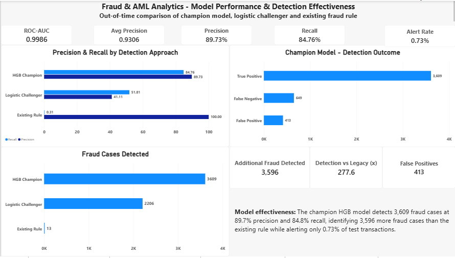
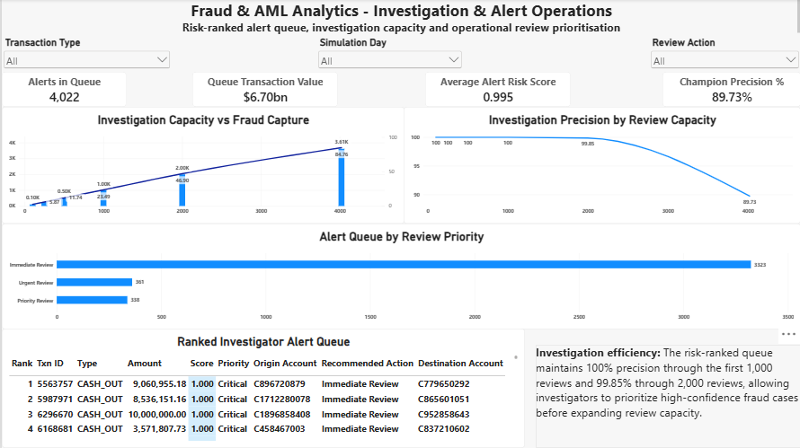
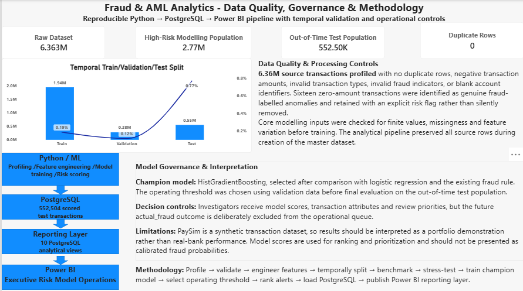

# Fraud & AML Analytics

End-to-end fraud detection and investigation analytics project using **Python, PostgreSQL, machine learning and Power BI**.

The project analyses more than **6.36 million synthetic financial transactions**, develops an out-of-time fraud detection model, creates risk tiers and an investigator alert queue, loads analytical outputs into PostgreSQL, and presents the results through a five-page Power BI dashboard.

> **Dataset note:** This project uses the PaySim synthetic transaction dataset. Results demonstrate analytical and modelling methodology and should not be interpreted as real-bank production performance.

---

## Project Objectives

The project was designed to answer five business questions:

- Where is fraud risk concentrated?
- Which transaction characteristics are most associated with fraud?
- Can machine learning materially improve detection over the existing fraud rule?
- How can alerts be prioritised under limited investigation capacity?
- How can the analysis be delivered through a reproducible Python → PostgreSQL → Power BI workflow?

---

## Technology Stack

| Area | Tools |
|---|---|
| Data analysis | Python, pandas, NumPy |
| Machine learning | scikit-learn |
| Models | Logistic Regression, HistGradientBoosting |
| Database | PostgreSQL |
| Data engineering | PyArrow, Parquet, PostgreSQL COPY |
| Visualisation | Power BI, matplotlib |
| Development | PyCharm, pgAdmin 4 |
| Version control | GitHub |

---

## Dataset

The project uses the **PaySim synthetic mobile-money transaction dataset**.

### Source population

- **6,362,620 transactions**
- 5 transaction types
- **8,213 fraud-labelled transactions**
- Overall fraud rate approximately **0.129%**

Fraud was concentrated entirely in:

- `TRANSFER`
- `CASH_OUT`

This produced a focused high-risk modelling population of:

**2,770,409 transactions**

while retaining all **8,213 fraud cases**.

---

## Data Quality & Feature Engineering

The data-quality process included checks for:

- duplicate rows
- invalid transaction types
- invalid fraud labels
- blank account identifiers
- negative transaction amounts
- zero-value transactions
- balance inconsistencies
- high-value transactions
- missing and non-finite engineered features

No source rows were removed during creation of the master analytical dataset.

Sixteen zero-amount fraud-labelled transactions were identified as anomalies and retained with an explicit risk flag rather than silently removed.

Engineered features included:

- simulation day and hour
- log-transformed transaction amount
- log-transformed origin and destination balances
- high-value transaction indicators
- zero-balance indicators
- amount-to-balance diagnostics
- cyclical hour features

---

## Modelling Methodology

A chronological out-of-time evaluation design was used instead of a random train/test split.

| Split | Rows | Fraud Cases | Fraud Rate |
|---|---:|---:|---:|
| Train | 1,938,484 | 3,633 | 0.19% |
| Validation | 279,421 | 322 | 0.12% |
| Test | 552,504 | 4,258 | 0.77% |

The validation period was used for model and operating-threshold decisions.

The final test period remained untouched until final evaluation.

---

## Model Development

Several Logistic Regression specifications were tested to assess feature redundancy and synthetic-data effects.

A seven-feature Logistic Regression model was selected as the strongest interpretable challenger.

The final tree-based model used the same defensible seven-feature specification:

- Transaction type
- Log transaction amount
- Log origin balance
- Log destination balance
- Cyclical simulated-hour features
- High-value transaction indicator

The final champion algorithm was:

**HistGradientBoostingClassifier**

---

## Final Model Performance

### Out-of-Time Test Results

| Metric | HistGradientBoosting | Logistic Challenger | Existing Rule |
|---|---:|---:|---:|
| ROC-AUC | **0.9986** | 0.9653 | — |
| Average Precision | **0.9306** | 0.4688 | — |
| Precision | **89.73%** | 41.11% | 100.00% |
| Recall | **84.76%** | 51.81% | 0.31% |
| F2 | **0.8571** | 0.4925 | 0.0038 |
| Fraud Detected | **3,609** | 2,206 | 13 |
| False Positives | **413** | 3,160 | 0 |
| Fraud Missed | **649** | 2,052 | 4,245 |
| Alerts | **4,022** | 5,366 | 13 |

The champion model detected approximately **278 times as many fraud cases as the existing rule** on the same out-of-time test population.

Only **0.73% of high-risk test transactions** were sent to the operational investigation queue.

---

## Key Business Findings

### Fraud concentration

The **Critical** model-risk tier represented only approximately **1.2% of high-risk test transactions**, yet contained:

- **93.05% of fraud cases**
- approximately **99.5% of fraud value**

### High-value transaction risk

Fraud incidence increased materially among large transactions and reached approximately:

**22.46% for transactions above 5 million**

in the out-of-time high-risk test population.

### Transaction type

TRANSFER and CASH_OUT contained the same number of test-period fraud cases, but TRANSFER had approximately **four times the fraud rate** because of its smaller transaction population.

### Model drivers

Permutation importance identified the strongest champion-model predictors as:

1. Origin balance
2. Transaction amount
3. Destination balance
4. Transfer transaction type
5. Simulated-hour pattern

### Investigation efficiency

The ranked alert queue achieved:

| Alerts Reviewed | Fraud Found | Precision | Total Fraud Captured |
|---:|---:|---:|---:|
| 100 | 100 | 100.00% | 2.35% |
| 250 | 250 | 100.00% | 5.87% |
| 500 | 500 | 100.00% | 11.74% |
| 1,000 | 1,000 | 100.00% | 23.49% |
| 2,000 | 1,997 | 99.85% | 46.90% |
| 4,022 | 3,609 | 89.73% | 84.76% |

---

# Power BI Dashboard

The final dashboard contains five reporting pages.

## 1. Executive Fraud Risk Overview



Provides an executive view of transaction exposure, fraud volume, risk-tier concentration, transaction-type risk and model-vs-rule detection performance.

---

## 2. Fraud Risk Drivers & Patterns



Explores model feature importance, transaction-value risk, simulated-hour patterns and fraud activity across the out-of-time period.

---

## 3. Model Performance & Detection Effectiveness



Compares the HistGradientBoosting champion, Logistic Regression challenger and existing rule using precision, recall, fraud detection, alert volume and classification outcomes.

---

## 4. Investigation & Alert Operations



Provides investigation-capacity analysis, risk-ranked alerts, review priorities and an operational investigator queue.

---

## 5. Data Quality, Governance & Methodology



Documents the analytical pipeline, data-quality controls, temporal validation methodology and key model-governance limitations.

---

## Solution Architecture

```text
PaySim Transaction Data
        ↓
Python Data Profiling
        ↓
Data Quality Validation
        ↓
Feature Engineering
        ↓
Temporal Train / Validation / Test Split
        ↓
Logistic Regression Benchmarking
        ↓
HistGradientBoosting Champion Model
        ↓
Risk Scoring & Alert Prioritisation
        ↓
PostgreSQL Analytical Database
        ↓
PostgreSQL Reporting Views
        ↓
Power BI Dashboard
```

---

## PostgreSQL Reporting Layer

The project includes a structured PostgreSQL reporting layer with analytical views for:

- executive fraud KPIs
- risk-tier analysis
- transaction-type risk
- daily fraud trends
- hourly fraud patterns
- confusion-matrix outcomes
- model performance
- investigation capacity
- investigator alert queue
- model feature importance

This separates analytical processing from the Power BI presentation layer.

---

## Repository Structure

```text
fraud-aml-analytics/
│
├── 02_python/
│   ├── 01_data_loading_profiling.py
│   ├── 02_full_data_profiling.py
│   ├── 03_data_quality_rules.py
│   ├── 04_create_analytical_dataset.py
│   ├── 05_exploratory_fraud_analysis.py
│   ├── 06_high_risk_model_preparation.py
│   ├── 07_baseline_logistic_regression.py
│   ├── 08_logistic_feature_stress_test.py
│   ├── 09_histgradientboosting_model.py
│   ├── 10_fraud_risk_tiers_alert_queue.py
│   └── 11_load_postgresql.py
│
├── 03_sql/
│   ├── 01_create_fraud_analytics_schema.sql
│   ├── 02_validate_fraud_analytics_load.sql
│   ├── 03_create_powerbi_views.sql
│   └── 04_validate_powerbi_views.sql
│
├── 04_powerbi/
│   └── screenshots/
│       ├── 01_Executive_Overview.png
│       ├── 02_Risk_Drivers_Patterns.png
│       ├── 03_Model_Performance.png
│       ├── 04_Investigation_Operations.png
│       └── 05_Governance_Methodology.png
│
├── 06_documentation/
├── requirements.txt
├── .gitignore
└── README.md
```

---

## Reproducibility

Install the required Python packages with:

```bash
pip install -r requirements.txt
```

Run the Python scripts sequentially from `02_python`.

PostgreSQL database objects are created using the scripts in `03_sql`.

Large raw data files, generated Parquet datasets, model-scoring files and database credentials are intentionally excluded from the repository.

---

## Model Governance & Limitations

PaySim is a **synthetic dataset**, so reported performance should be treated as a demonstration of analytical methodology rather than expected real-world banking performance.

The project deliberately:

- uses chronological out-of-time validation
- separates validation-based threshold selection from final test evaluation
- excludes post-transaction fields from the primary predictive model
- stress-tests potentially synthetic-data-specific features
- excludes the future fraud outcome from the investigator-facing queue
- treats model outputs as risk-ranking scores rather than calibrated real-world probabilities

A real production fraud solution would require validation on live institutional data, probability calibration, ongoing drift monitoring, model-risk controls, fairness assessment and operational governance.

---

## Skills Demonstrated

**Python:** pandas, NumPy, scikit-learn, PyArrow, data profiling, feature engineering and machine learning  
**SQL/PostgreSQL:** schema design, validation, indexing, bulk loading and analytical views  
**Machine Learning:** imbalanced classification, temporal validation, threshold optimisation, Logistic Regression and HistGradientBoosting  
**Power BI:** DAX, semantic modelling, KPI design, investigation dashboards and executive reporting  
**Business Analytics:** fraud-risk segmentation, operational alert prioritisation, investigation-capacity analysis and model governance

---

## Project Status

**Completed**

The project demonstrates an end-to-end analytical workflow from raw transaction data through machine learning, database engineering and executive/operational reporting.
